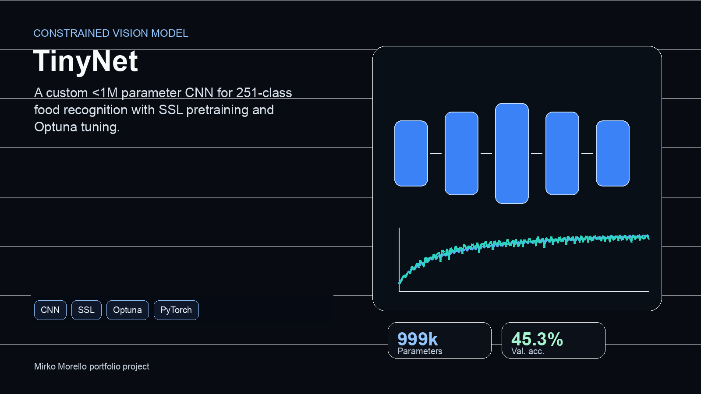

# MSc Supervised Learning - Course Repository

<div align="center">

**Master's Degree in Data Science - University of Milano-Bicocca**

[](https://www.python.org/downloads/)
[](https://pytorch.org/)
[](https://scikit-learn.org/)

*A comprehensive collection of assignments, lecture notes, and projects from the Supervised Learning course*

</div>

<p align="center">
  
</p>

---

## 📚 Repository Overview

This repository contains all coursework, implementations, and research from the Supervised Learning course, including:

- **Weekly Assignments**: Hands-on exercises covering fundamental ML concepts
- **Lecture Notes**: Detailed notes and code examples from class sessions
- **Final Project**: TinyNet - A custom CNN for food classification with <1M parameters

---

## 🎯 Final Project: TinyNet

### Food Classification with Constrained CNN Architecture

A complete deep learning project tackling a challenging 251-class food image classification task with strict architectural constraints.

**Key Achievements:**
- ✅ Custom CNN architecture with exactly 999,675 parameters (< 1M constraint)
- ✅ 45.3% validation accuracy on 251 food categories
- ✅ Self-supervised pre-training for representation learning and convergence analysis
- ✅ Automated hyperparameter optimization with Optuna

**Techniques Implemented:**
- Convolutional Neural Networks (CNNs) with GELU activations
- Self-Supervised Learning (SSL) via image reconstruction
- Hyperparameter tuning with pruning strategies
- Advanced data augmentation preserving food characteristics
- Transfer learning from pre-trained encoder

**📂 Project Location:** [`Final_Project/`](./Final_Project/)

**📖 Documentation:**
- [Comprehensive README](./Final_Project/README.md) - Setup, usage, and results
- [Architecture Details](./Final_Project/ARCHITECTURE.md) - In-depth technical breakdown
- [Project Report (PDF)](./Final_Project/Supervised_Learning__Final_project_.pdf) - Full academic paper

---

## 📝 Course Assignments

The `Assignments/` directory contains weekly exercises covering:

### Topics Covered
1. **Linear Regression** - Least squares, regularization (Ridge, Lasso)
2. **Logistic Regression** - Binary and multi-class classification
3. **Support Vector Machines** - Kernel methods, margin optimization
4. **Decision Trees** - CART, pruning, ensemble methods
5. **Neural Networks** - Backpropagation, activation functions
6. **Deep Learning** - CNNs, batch normalization, dropout
7. **Model Selection** - Cross-validation, hyperparameter tuning
8. **Ensemble Methods** - Bagging, boosting, random forests
9. **Dimensionality Reduction** - PCA, feature selection
10. **Evaluation Metrics** - Confusion matrix, ROC curves, F1-score

Each assignment includes:
- Problem statements
- Implementation in Python/PyTorch
- Analysis and results
- Visualizations

---

## 📖 Lecture Notes

The `Lessons_notes/` directory contains organized notes from each lecture:

```
Lessons_notes/
├── L01/ - Introduction to Supervised Learning
├── L02/ - Linear Models
├── L03/ - Regularization Techniques
├── L04/ - Classification Fundamentals
├── L05/ - Support Vector Machines
├── L06/ - Kernel Methods
├── L07/ - Decision Trees
├── L08/ - Ensemble Methods
├── L09/ - Neural Networks Basics
├── L10/ - Deep Learning
├── L11/ - Convolutional Networks
├── L12/ - Advanced CNN Architectures
└── L13/ - Self-Supervised Learning
```

Notes include:
- Theoretical concepts with mathematical derivations
- Code implementations and examples
- Visualizations and diagrams
- References to key papers

---

## 🛠️ Technologies Used

### Core Libraries
- **PyTorch**: Deep learning framework for neural network implementation
- **scikit-learn**: Classical ML algorithms and utilities
- **NumPy**: Numerical computing
- **Pandas**: Data manipulation and analysis
- **Matplotlib/Seaborn**: Data visualization

### Specialized Tools
- **Optuna**: Hyperparameter optimization framework
- **TorchMetrics**: Evaluation metrics for PyTorch
- **OpenCV**: Image processing for computer vision
- **TensorBoard**: Training visualization and monitoring

---

## 📊 Repository Structure

```
MSc_Supervised_Learning/
│
├── Final_Project/                    # Main project - TinyNet
│   ├── README.md                     # Comprehensive documentation
│   ├── ARCHITECTURE.md               # Technical architecture details
│   ├── main.py                       # Main training script
│   ├── htuning.py                    # Hyperparameter tuning
│   ├── pickles/                      # Training metrics and results
│   └── Supervised_Learning__Final_project_.pdf
│
├── Assignments/                      # Weekly coursework
│   ├── Assignment_01/
│   ├── Assignment_02/
│   └── ...
│
├── Lessons_notes/                    # Lecture materials
│   ├── L01/ through L13/
│   └── Additional resources
│
├── .gitignore
└── README.md                         # This file
```

---

## 🚀 Getting Started

### Prerequisites

```bash
Python 3.8+
CUDA-capable GPU (recommended for Final Project)
```

### Installation

1. **Clone the repository**
```bash
git clone <repository-url>
cd MSc_Supervised_Learning
```

2. **Set up virtual environment**
```bash
python -m venv venv
source venv/bin/activate  # On Windows: venv\Scripts\activate
```

3. **Install dependencies**

For the Final Project:
```bash
cd Final_Project
pip install torch torchvision torchaudio --index-url https://download.pytorch.org/whl/cu118
pip install pandas numpy matplotlib seaborn pillow scikit-learn
pip install tqdm optuna torchsummary torchmetrics tensorboard opencv-python
```

For assignments:
```bash
pip install numpy pandas scikit-learn matplotlib seaborn jupyter
```

### Running the Final Project

```bash
cd Final_Project

# Train TinyNet from scratch
python main.py

# Run hyperparameter optimization
python htuning.py

# View results in TensorBoard
tensorboard --logdir=runs/
```

Detailed instructions available in [`Final_Project/README.md`](./Final_Project/README.md)

---

## 📈 Key Results

### Final Project Performance

| Metric | Value | Context |
|--------|-------|---------|
| **Validation Accuracy** | 45.3% | 251 food categories |
| **F1-Score (micro)** | 0.4533 | Balanced performance |
| **Model Parameters** | 999,675 | < 1M constraint ✓ |
| **Training Time** | ~3 hours | RTX 3080, 150 epochs |

### Model Variants

| Configuration | Accuracy | Notes |
|---------------|----------|-------|
| TinyNet + SSL | **45.31%** | Best final accuracy in the tracked runs |
| TinyNet Baseline | 45.31% | Nearly identical final accuracy |
| Tuned + SSL | 43.93% | Faster convergence |
| Tuned Only | 43.83% | Different optimum |

---

## 🎓 Learning Outcomes

Through this course and project, I developed expertise in:

1. **Classical ML**: Strong foundation in traditional supervised learning algorithms
2. **Deep Learning**: Hands-on experience with CNN architectures and training
3. **Model Optimization**: Hyperparameter tuning, regularization, and convergence strategies
4. **Research Skills**: Literature review, experimentation, and technical writing
5. **Software Engineering**: Clean code, version control, and reproducible research
6. **Problem Solving**: Working within constraints, debugging, and iterative improvement

---

## 📚 References

### Course Materials
- Lecture slides and notes (included in `Lessons_notes/`)
- Recommended textbooks:
  - *Pattern Recognition and Machine Learning* - Bishop
  - *Deep Learning* - Goodfellow, Bengio, Courville
  - *Hands-On Machine Learning* - Géron

### Final Project References
1. Krizhevsky et al. (2012) - AlexNet
2. Simonyan & Zisserman (2015) - VGG
3. Ronneberger et al. (2015) - U-Net
4. Hendrycks & Gimpel (2023) - GELU
5. Akiba et al. (2019) - Optuna

See [`Final_Project/README.md`](./Final_Project/README.md) for complete bibliography.

---

## 👥 Authors

**Student**: Mirko Morello (920601), Andrea Borghesi (916202)
**Institution**: University of Milano-Bicocca
**Program**: MSc in Data Science
**Course**: Supervised Learning
**Academic Year**: 2024-2025

---

## 📜 License

This repository contains academic coursework and is intended for educational purposes. Please respect academic integrity policies if referencing this work.

---

## 🙏 Acknowledgments

- **Instructors**: For comprehensive course materials and guidance
- **Teaching Assistants**: For support during assignments
- **PyTorch Community**: For excellent documentation and examples
- **Optuna Team**: For powerful hyperparameter optimization tools

---

<div align="center">

**⭐ If you found this repository helpful, please consider giving it a star! ⭐**

*For questions about the Final Project, see the [project README](./Final_Project/README.md)*

</div>
