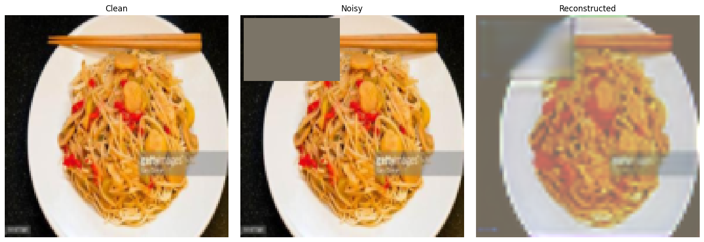
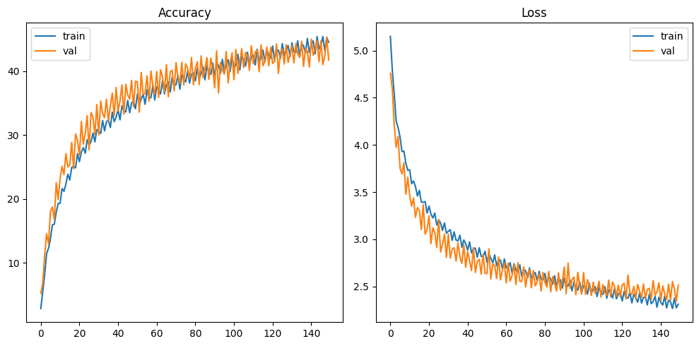
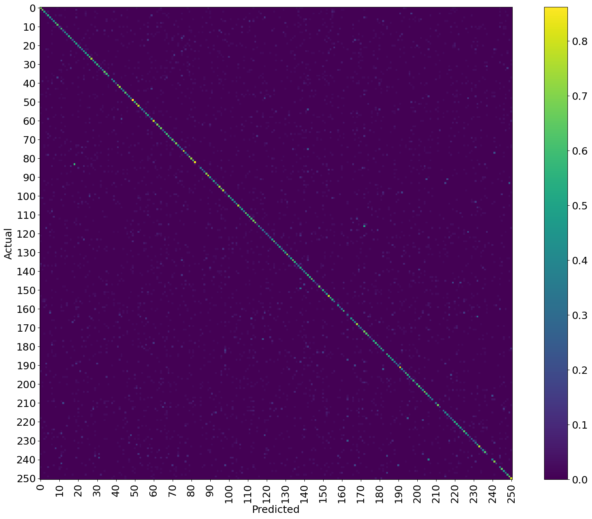

# TinyNet — Food Classification Under a 1M-Parameter Budget


Image classification of 158,846 food photos across 251 categories with
TinyNet, a custom CNN designed to stay under one million parameters
(997,763 in the Optuna-tuned variant). A self-supervised pretraining stage
— reconstructing images with randomly masked black boxes, U-Net style —
provides encoder weights that make training faster and more stable. The
best model reaches 45.33% validation accuracy (micro-average F1 0.4533)
over 251 classes.

Final project for the **Supervised Learning** course, MSc in Artificial
Intelligence (University of Milano-Bicocca), with Andrea Borghesi.

<p align="center"></p>
<p align="center"><em>The self-supervised pretext task: a random black box
masks the image and the network learns to reconstruct it. Source: report,
Fig. 2.</em></p>

## Results

| Model | Validation accuracy |
|---|---|
| TinyNet + SSL encoder weights (best) | **45.33%** |
| TinyNet, random init | 45.31% |
| Optuna-tuned TinyNet (no SSL / SSL) | 43.83% / 43.93% |

Micro-average F1 of the best model: 0.4533 (251 classes). Dataset split:
118,475 train (74.6%) / 11,994 val (7.5%) / 28,377 unlabeled test images
used for the self-supervised task (17.9%). All numbers from the report,
Sections 2 and 7.

## Approach

- **TinyNet**: 5 convolutional blocks (Conv2d + GELU + BatchNorm +
  MaxPool) and 2 fully-connected layers, tuned with Optuna to 997,763
  parameters (report, Table 2).
- **Self-supervised pretraining**: black-box masking + reconstruction for
  60 epochs with a U-Net-inspired decoder; the encoder is then transferred
  to the classifier.
- **Data augmentation**: random rotations, translations, flips and affine
  transforms — no color transformations, to preserve food appearance.
- SSL weights improve convergence speed and stability; the final accuracy
  gain is small (+0.02%), which the report attributes to both variants
  having enough epochs to converge.

<p align="center"></p>
<p align="center"><em>Training and validation curves of the SSL-initialized
network, 150 epochs, no overfitting signs. Source: report, Fig. 4.</em></p>

<p align="center"></p>
<p align="center"><em>Accuracy heatmap across all 251 categories: a clear
diagonal, with confusions concentrated among similar dishes. Source:
report, Fig. 6.</em></p>

## How to run

The final project lives in `Final_Project/`: `main.py` is a
[jupytext](https://jupytext.readthedocs.io/) percent-format notebook with
the full pipeline, `htuning.py` runs the Optuna hyperparameter search.
Weekly assignments are under `Assignments/A01`–`A09`.

```sh
pip install torch torchvision optuna scikit-learn matplotlib jupytext
jupytext --to notebook Final_Project/main.py   # or open main.py directly in VS Code / Jupyter
python Final_Project/htuning.py                # Optuna search
```

## Report

Full write-up: [Supervised_Learning__Final_project_.pdf](Final_Project/Supervised_Learning__Final_project_.pdf)
— Mirko Morello, Andrea Borghesi, January 2025.
